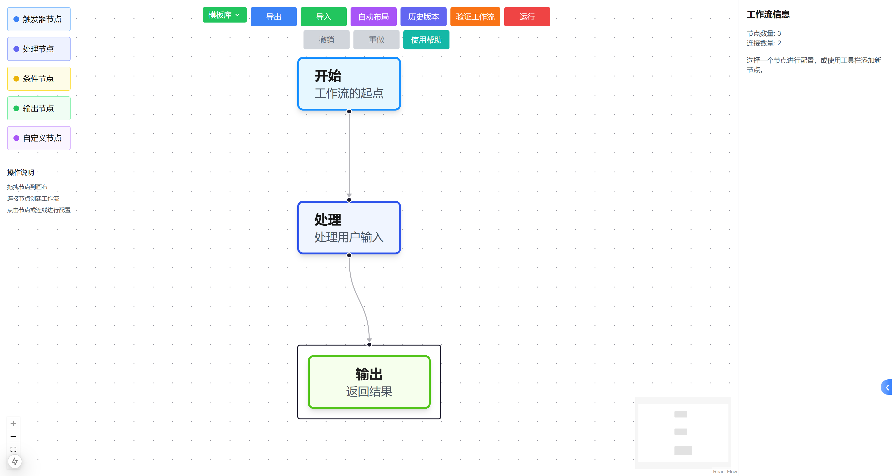

# AI 工作流编辑器

一个可视化的 AI 工作流设计与编辑工具，帮助用户轻松创建、编辑和管理 AI 工作流程。



## 功能特点

1. **直观的拖放式界面**：轻松创建复杂工作流，支持网格对齐和自动布局
2. **节点连接与配置**：支持创建、编辑和删除连接线，支持直线、曲线和折线
3. **节点参数配置**：支持各类节点的参数设置和验证
4. **工作流验证功能**：检查节点连接和配置的有效性
5. **模板库**：支持常用工作流的快速创建和自定义模板保存
6. **多格式导出**：支持导出为图片（PNG、SVG）和 JSON 格式
7. **执行可视化**：实时展示工作流执行状态，包括节点执行进度和数据流向

## 技术栈

- Next.js 15
- React 18
- React Flow（流程图可视化）
- TypeScript
- Tailwind CSS
- Zustand (状态管理)

## 节点类型

- **触发器节点**：工作流的起点，如用户输入、API 请求、定时任务等
- **处理节点**：执行各种数据处理操作，如数据转换、AI 补全、API 调用等
- **条件节点**：根据条件选择不同分支路径
- **输出节点**：工作流的终点，处理最终结果输出

## 快速开始

### 安装依赖

```bash
npm install
```

### 启动开发服务器

```bash
npm run dev
```

### 访问应用

```bash
http://localhost:3000
```

## 项目结构

```bash
src/
├── app/
│   ├── workflow-editor/
│   ├── page.tsx
│   └── layout.tsx
├── components/ # 组件目录
├── workflow/ # 工作流组件目录
├── nodes/ # 节点组件目录
├── NodeConfigPanel.tsx # 节点配置面板
├── NodeToolbar.tsx # 节点工具栏
├── TriggerNode.tsx # 触发器节点
├── ProcessNode.tsx # 处理节点
├── ConditionNode.tsx # 条件节点
├── OutputNode.tsx # 输出节点
├── TemplateLibrary.tsx # 模板库
├── WorkflowEditor.tsx # 工作流编辑器
├── index.tsx # 入口文件
├── globals.css # 全局样式
├── package.json # 项目配置
├── tsconfig.json # TypeScript 配置
├── next.config.js # Next.js 配置
└── tailwind.config.js # Tailwind CSS 配置
```

## 使用指南

### 基本操作

1. **创建节点**：从左侧工具栏拖拽节点到画布
2. **连接节点**：点击节点的连接点并拖动到目标节点
3. **配置节点**：点击节点后在右侧面板中编辑节点属性
4. **配置连线**：点击连线后在右侧面板中选择连线类型

### 高级功能

- **验证工作流**：使用工具栏的"验证"按钮检查工作流的有效性
- **运行工作流**：使用"运行"按钮查看工作流执行过程的可视化
- **自动布局**：使用"自动布局"按钮优化节点排列
- **保存/导出**：将工作流保存为 JSON 或导出为 PNG/SVG 图片

### 内置模板

- **简单对话流程**：基础的用户输入-AI 响应流程
- **内容生成流程**：根据提示生成并优化内容的流程
- **数据处理流程**：处理和转换数据的多步骤流程
- **客户支持流程**：自动化客户支持请求处理流程

## 定制化开发

### 添加新节点类型

1. 在 `src/components/workflow/nodes/` 目录创建新的节点组件
2. 在 `src/aisettings.ts` 中添加新的节点类型定义
3. 在主编辑器组件中注册新节点类型

### 自定义模板

1. 在 `src/examples/` 目录创建新的模板定义
2. 在 `src/components/workflow/TemplateLibrary.tsx` 中注册新模板

## 项目贡献

欢迎提交问题和改进建议！
